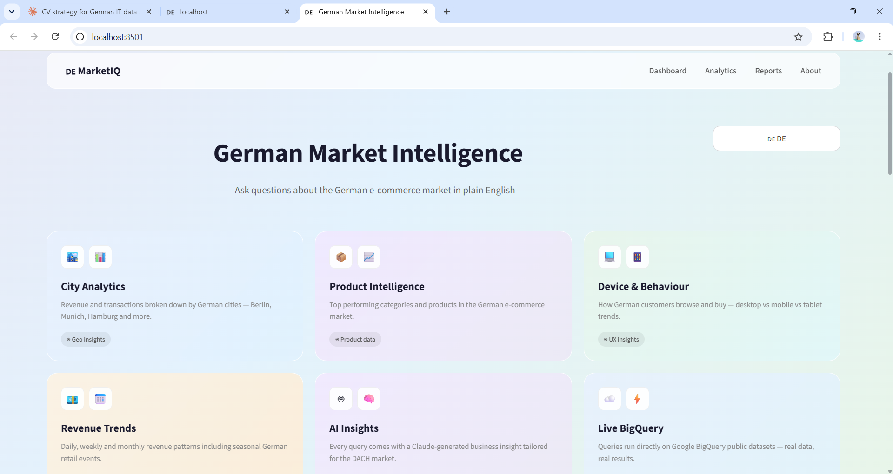
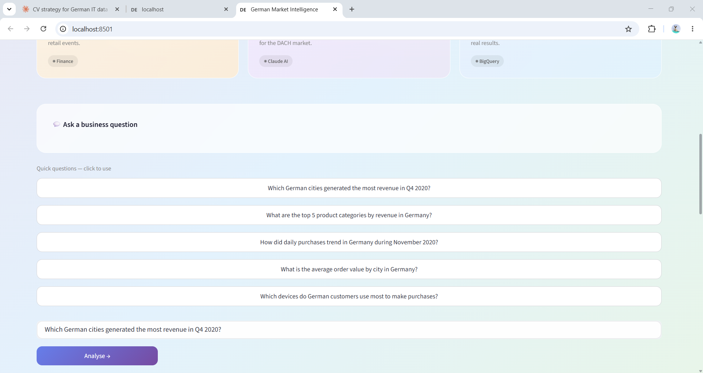
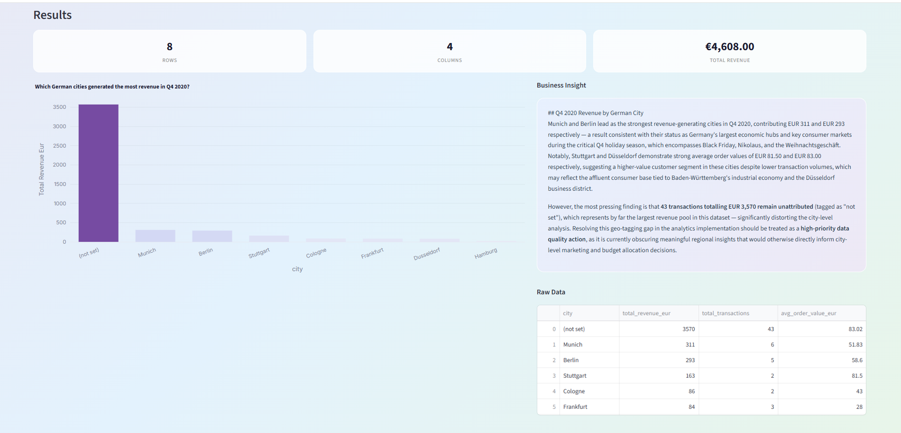

# 🇩🇪 German Market Sales Intelligence

> AI-powered e-commerce analytics · BigQuery + Claude AI + Streamlit  
> Ask questions about the German market in plain English or German. Get SQL, charts, and business insights automatically.

---

## 📌 Project Overview

An AI-assisted business intelligence tool built for the **German e-commerce market (DACH region)**. A user types a business question in English or German — the app generates a BigQuery SQL query using Claude AI, runs it against real Google Merchandise Store data, and returns an interactive chart plus a professionally written business insight.

---

## 🖥️ App Screenshots





---

## 🛠️ Tech Stack

| Layer | Technology |
|---|---|
| Data Warehouse | Google BigQuery |
| AI / LLM | Anthropic Claude (claude-sonnet-4-6) |
| Data Processing | Python · Pandas |
| Frontend | Streamlit · Plotly |
| Version Control | Git · GitHub |

---

## ⚙️ Architecture

User Question (EN/DE)

↓

Claude AI → generates BigQuery SQL

↓

BigQuery → queries GA4 e-commerce dataset (Germany only)

↓

Pandas → processes results into dataframe

↓

Plotly → renders interactive chart

↓

Claude AI → generates business insight in EN or DE

↓

Streamlit UI → displays chart + insight + raw data

---

## 🇩🇪 German Market Focus

- All queries filtered to **geo.country = 'Germany'** by default
- City-level breakdowns: **Berlin, Munich, Hamburg, Frankfurt, Cologne**
- Revenue expressed in **EUR**
- Insights reference German retail calendar: *Weihnachtsgeschäft*, Black Friday DE, Sommerschlussverkauf
- Full **bilingual UI** — switch between 🇬🇧 EN and 🇩🇪 DE instantly

---

## 📊 Example Questions

- Which German cities generated the most revenue in Q4 2020?
- What are the top 5 product categories by revenue in Germany?
- How did daily purchases trend in Germany during November 2020?
- What is the average order value by city in Germany?
- Which devices do German customers use most to make purchases?

---

## 🔧 Setup & Installation

### Prerequisites
- Python 3.9+
- Google Cloud account with BigQuery enabled
- Anthropic API key

### Installation

```bash
# Clone the repository
git clone https://github.com/MuhammadAli-99/sales-intelligence-assistant.git
cd sales-intelligence-assistant

# Create virtual environment
python -m venv venv
venv\Scripts\activate  # Windows

# Install dependencies
pip install -r requirements.txt
```

### Configuration

Create a `.env` file in the project root:

ANTHROPIC_API_KEY=your-anthropic-key-here

GOOGLE_CLOUD_PROJECT=your-gcp-project-id

Authenticate with Google Cloud:

```bash
gcloud auth application-default login
```

### Run the app

```bash
streamlit run app/main.py
```

---

## 📁 Project Structure
sales-intelligence-assistant/

├── app/

│   ├── main.py              # Streamlit UI

│   ├── bigquery_client.py   # BigQuery connection and queries

│   └── llm_engine.py        # Claude AI SQL generation and insights

├── assets/                  # App screenshots

├── .env                     # API keys (not committed)

├── .gitignore

├── requirements.txt

└── README.md

---

## 💡 Key Learnings

- Prompt engineering for text-to-SQL generation with schema context
- Integrating LLM APIs into a data analytics pipeline
- Building bilingual Streamlit applications for the DACH market
- Working with Google BigQuery public datasets
- Structuring a production-style Python project with Git

---

## 📬 Contact

**Muhammad Ali**  
TU Ilmenau · Data Analytics  
[GitHub](https://github.com/MuhammadAli-99)